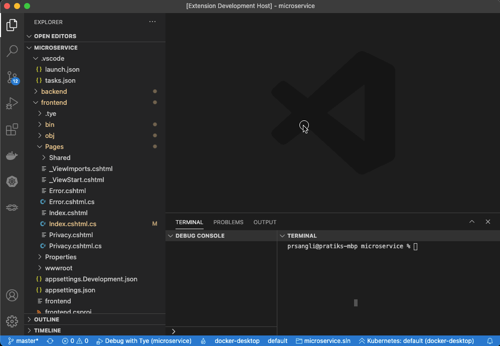
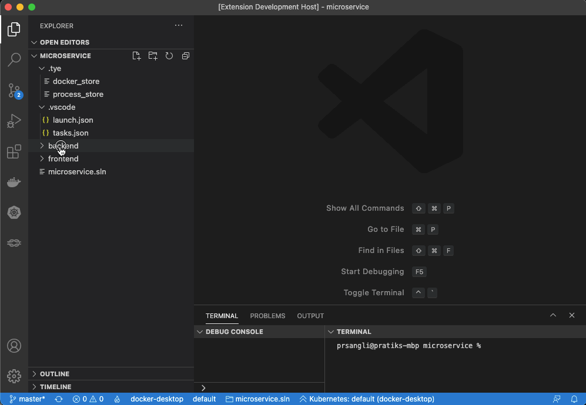
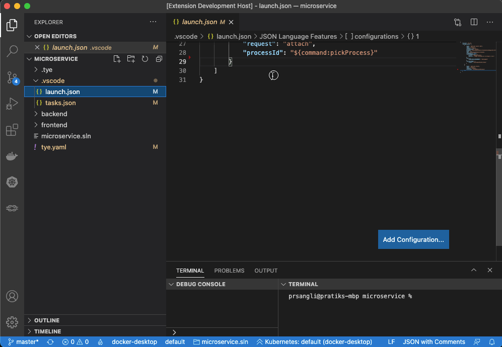
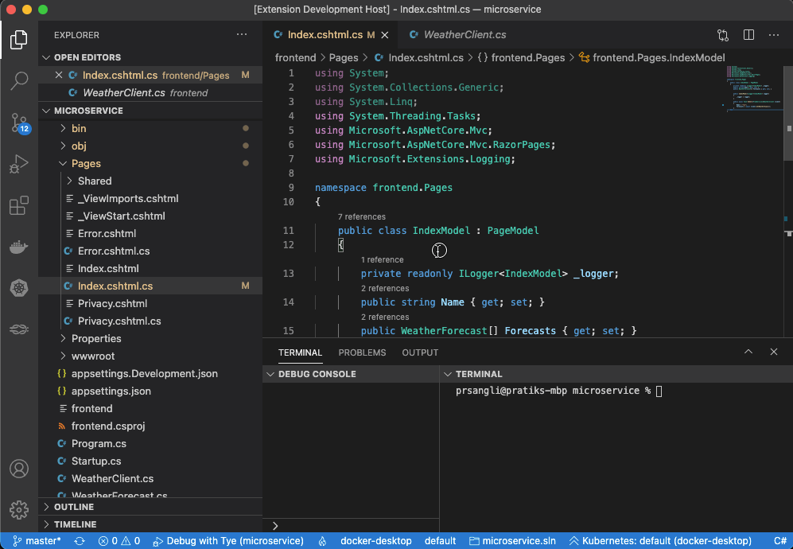
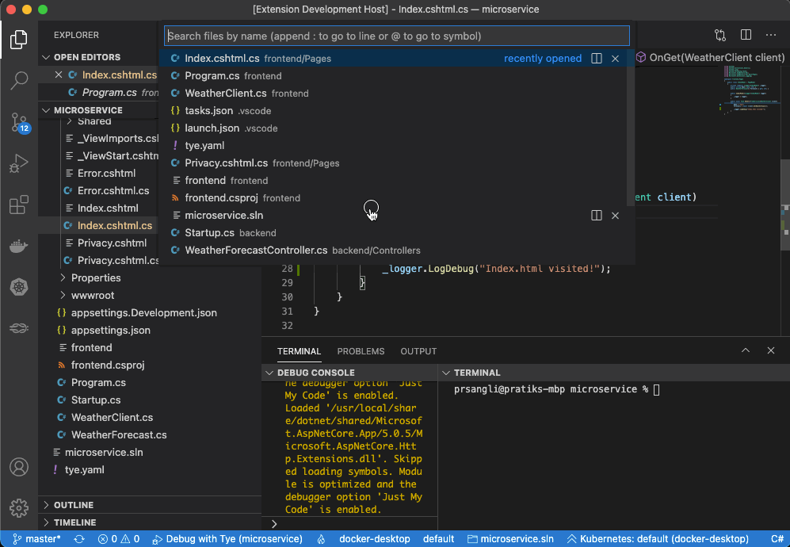
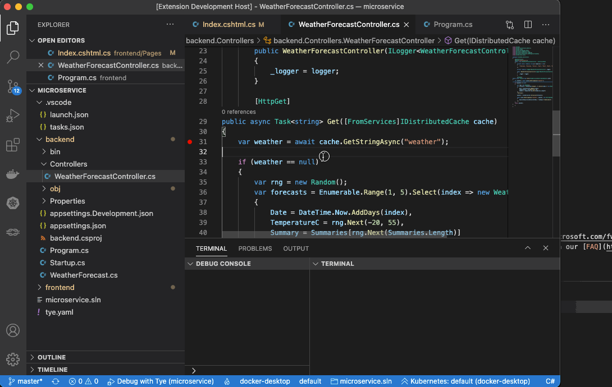
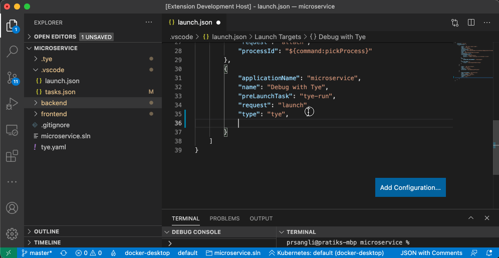
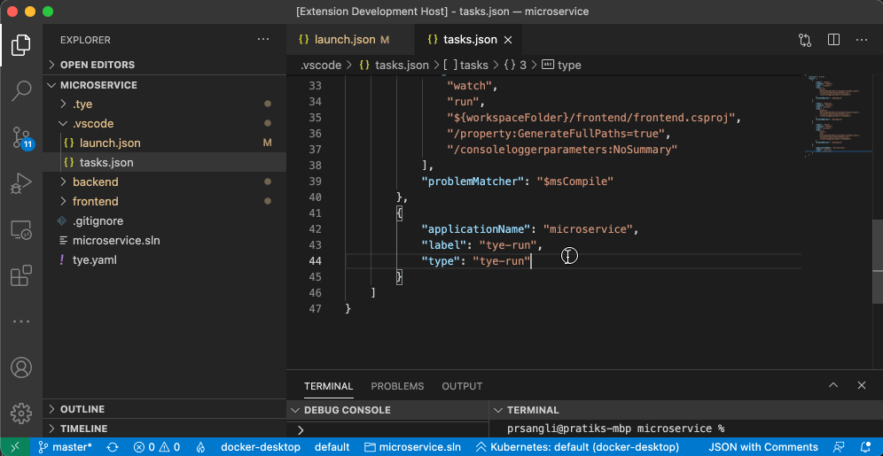

# Tye for Visual Studio Code (Preview)

[?branchName=main)](https://dev.azure.com/ms-azuretools/AzCode/_build/latest?definitionId=35&branchName=main)

The Tye extension makes it easier to run and debug applications that are using [Tye](https://github.com/dotnet/tye)

## Prerequisites

### Docker

Using Tye requires Docker to be installed.\
[Install Docker](https://docs.docker.com/get-docker/) on your machine and add it to the system path.

### Tye

Using the Tye tooling requires a project to be run using the Tye CLI.\
Instructions for installing Tye CLI can be found [here](https://github.com/dotnet/tye/blob/main/docs/getting_started.md).

### Visual Studio Code
[Download](https://code.visualstudio.com/Download) and install Visual Studio Code on your machine.

## Feature Overview
The Tye extension lets you view and debug Tye services.

### View running Tye application
You can view the running Tye application, view all services and it's replicas, view logs and open the services in the browser.

### Generating Tye assets
You can add `tye.yaml` file to your workspace by opening the Command Palette (<kbd>F1</kbd>) and using **Tye: Initialize Tye** command. The command will generate `tye.yaml` based on .NET projects in the solution currently open in the workspace.

### Generating task and launch configuration
You can add the task **tye-run** to run the Tye application and a debug launch configuration **Debug with Tye** to debug the Tye application by opening the Command Palette (<kbd>F1</kbd>) and using the **Tye: Scaffold Tye Tasks** command.

### Running and debugging the Tye application
The extension offers command to run the Tye application, attach the debugger to already running service or start the Tye application with debugger attached to all debuggable services.

#### Run the Tye application
You can run the Tye application by running the task **tye-run**.

#### Debug an already running service
You can attach the debugger to an already running service by clicking on the **Attach** icon on any replica of the service you want to debug.

#### Debug with Tye
The **Debug with Tye** launch configuration helps you debug multiple services at a time.
The default scaffolded configuration attaches the debugger to all debuggable services, but it can be configured to attach to only a subset of services.

##### Configuring a subset of services to debug
Services to debug can be configured by adding `services` property in the **Debug with Tye** launch configuration.

##### Enabling the `watch` mode for debugging
The Tye extension lets you start the Tye application in the `watch` mode and subsequently attach the debugger in the `watch` mode. With the `watch` mode on, the debugger watches for any code changes and re-attaches to the re-spawned services.

## Contributing

This project welcomes contributions and suggestions.  Most contributions require you to agree to a
Contributor License Agreement (CLA) declaring that you have the right to, and actually do, grant us
the rights to use your contribution. For details, visit https://cla.opensource.microsoft.com.

When you submit a pull request, a CLA bot will automatically determine whether you need to provide
a CLA and decorate the PR appropriately (e.g., status check, comment). Simply follow the instructions
provided by the bot. You will only need to do this once across all repos using our CLA.

This project has adopted the [Microsoft Open Source Code of Conduct](https://opensource.microsoft.com/codeofconduct/).
For more information see the [Code of Conduct FAQ](https://opensource.microsoft.com/codeofconduct/faq/) or
contact [opencode@microsoft.com](mailto:opencode@microsoft.com) with any additional questions or comments.

## Telemetry

VS Code collects usage data and sends it to Microsoft to help improve our products and services. Read our [privacy statement](https://go.microsoft.com/fwlink/?LinkID=528096&clcid=0x409) to learn more. If you don’t wish to send usage data to Microsoft, you can set the `telemetry.enableTelemetry` setting to `false`. Learn more in our [FAQ](https://code.visualstudio.com/docs/supporting/faq#_how-to-disable-telemetry-reporting).

## Trademarks

This project may contain trademarks or logos for projects, products, or services. Authorized use of Microsoft trademarks or logos is subject to and must follow [Microsoft's Trademark & Brand Guidelines](https://www.microsoft.com/en-us/legal/intellectualproperty/trademarks/usage/general). Use of Microsoft trademarks or logos in modified versions of this project must not cause confusion or imply Microsoft sponsorship. Any use of third-party trademarks or logos are subject to those third-party's policies.

## Reporting security issues and bugs

The Tye extension is an experimental project, and as such we expect all users to take responsibility for evaluating the security of their own applications.

Security issues and bugs should be reported privately, via email, to the Microsoft Security Response Center (MSRC) secure@microsoft.com. You should receive a response within 24 hours. If for some reason you do not, please follow up via email to ensure we received your original message. Further information, including the MSRC PGP key, can be found in the Security TechCenter.